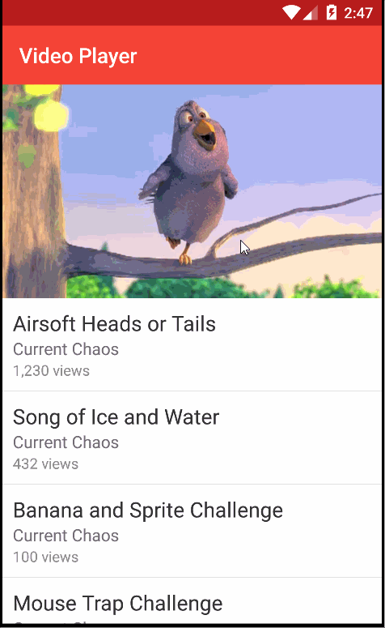

[](https://www.npmjs.com/package/nativescript-videoplayer)
[](https://www.npmjs.com/package/nativescript-videoplayer)

# NativeScript Video Player :clapper:
A NativeScript plugin to provide the ability to play local and remote videos.

#### Platform controls used: 
Android | iOS
---------- | -----------
[Android VideoView](http://developer.android.com/intl/zh-tw/reference/android/widget/VideoView.html) |  [iOS AVPlayer](https://developer.apple.com/library/prerelease/ios/documentation/AVFoundation/Reference/AVPlayer_Class/index.html)


## Sample Usage

                Sample 1             |              Sample 2
-------------------------------------| -------------------------------------
 | 


## Installation
From your command prompt/terminal go to your app's root folder and execute:

`tns plugin add nativescript-videoplayer`

## Usage

###
```XML
<Page xmlns="http://schemas.nativescript.org/tns.xsd"
      xmlns:VideoPlayer="nativescript-videoplayer">
        <StackLayout>
               
            <Video:Video id="nativeVideoPlayer"
            controls="true" finished="{{ videoFinished }}"
            loop="true" autoplay="false" height="280" 
            src="~/videos/big_buck_bunny.mp4" 
            row="0" colSpan="2" />

            <!-- Remote file to test with https://clips.vorwaerts-gmbh.de/big_buck_bunny.mp4 -->
            
        </StackLayout>
</Page>
```

## Attributes
**src** - *required*

Set the video file to play, for best performance use local video files if possible. The file must adhere to the platforms accepted video formats. For reference check the platform specs on playing videos.

**autoplay - (boolean)** - *optional*

Set if the video should start playing as soon as possible or to wait for user interaction.

**finished - (function)** - *optional*

Attribute to specify an event callback to execute when the video reaches the end of its duration.

**controls - (boolean)** - *optional*

Set to use the native video player's media playback controls.


## API

**play()** - start playing the video
**pause()** - pause the video
**seekToTime(time: number)** - seek the video to a time (milliseconds)
**getDuration()** - returns the duration of the video (milliseconds)
**getCurrentTime()** - returns the current time in the video duration (milliseconds)
**destroy()** - destroy the video player and free resources

#### Android only

**stop()** - stop the playback - this resets the player and remove the video src

#### iOS only

**mute(boolean)** - mute the current video


### Contributors

- Alex Ziskind [@digitalix](https://twitter.com/digitalix)
- Nathanael Anderson [@CongoCart](https://twitter.com/CongoCart)
- Blake Nussey
